# Purchase Tracker Controller - User Guide & SIPOC Diagram

Welcome to the **Purchase Tracker Controller**! This guide is designed for first-time users to understand how data flows through the application and how to operate the tool from start to finish.

---

## 1. SIPOC Process Flow

The following SIPOC (Supplier, Input, Process, Output, Customer) diagram illustrates the high-level data flow of the application.

```mermaid
flowchart LR
    subgraph Supplier [1. Supplier]
        S1[Vendors]
        S2[Finance / AP Team]
        S3[ERP Systems / Tally]
    end

    subgraph Input [2. Input]
        I1[Vendor Invoices .xlsx]
        I2[Tally Data .csv]
        I3[GRN Reports]
    end

    subgraph Process [3. Process]
        P1[Upload Files]
        P2[Create Master DB]
        P3[Apply Rules]
        P4[Reconcile Data]
    end

    subgraph Output [4. Output]
        O1[Cleaned Master DB]
        O2[Pivot Summaries]
        O3[Reconciliation Excel]
    end

    subgraph Customer [5. Customer]
        C1[Finance Managers]
        C2[Auditors]
        C3[Downstream ERP]
    end

    Supplier --> Input
    Input --> Process
    Process --> Output
    Output --> Customer

    %% Styling
    classDef default fill:#f9f9f9,stroke:#333,stroke-width:1px;
    classDef sub fill:#ebf8ff,stroke:#2b6cb0,stroke-width:2px;
    class Supplier,Input,Process,Output,Customer sub;
```

---

## 2. Getting Started

### Initial Setup (Run Once)
1. Locate the application folder on your computer.
2. Double-click **`setup.bat`**. 
3. A command prompt will open, create a virtual environment, and install all necessary dependencies. Once it says "Setup complete!", you can close it.

### Starting the Tool
1. Double-click **`start_server.bat`**.
2. A black terminal window will open and start the backend server on `Port 5000`. Keep this window open while you use the tool.
3. Your default web browser will automatically open the application at `http://localhost:5000`.

---

## 3. Step-by-Step Guide

### Step 1: Uploading Data (User Portal)
1. Navigate to the **Upload & Files** tab.
2. Select your target module (e.g., *GRN vs Vendor Invoice*).
3. Create a new folder or select an existing one.
4. Drag and drop your raw Excel (`.xlsx`, `.xls`) or `.csv` files into the upload area. 

> [!TIP]
> The system will automatically detect the Indian Financial Year (Apr-Mar) from your filenames if they are formatted correctly.

### Step 2: Creating a Master File (Admin Portal)
Before you can apply reconciliation rules, you must merge your uploaded files into a robust "Master File".
1. Select the folder containing your uploaded files.
2. Click **Create Master File**.
3. The system will ask you to select the target sheet, identify the header row, and select the specific columns you want to import.
4. Click **Confirm**. The system merges the data into a high-performance DuckDB database.

> [!NOTE]
> The system has a built-in **Deduplication Engine**. If you upload duplicate rows, they will be safely handled or soft-deleted to ensure your master database remains clean.

### Step 3: Configuring Rules
Navigate to the **Rules** tab. This is where you configure the ETL (Extract, Transform, Load) logic across 4 distinct phases:
* **Phase 1 (Primary Data):** Select your primary data columns and add basic formula fields (e.g., SUM, VLOOKUP).
* **Phase 2 (Matching):** Add cross-referencing rules (VLOOKUP, SUMIF, COUNTIF) to match data row-by-row against other folders.
* **Phase 3 (Conditions & Remarks):** Create advanced `IF/AND/OR` conditions to automatically assign remarks (e.g., "Match Found", "Amount Discrepancy").
* **Phase 4 (Summary):** Define how the final data should be aggregated into pivot tables and charts.

### Step 4: Final Processing & Reconciliation
1. Navigate to the **Final Processing** tab.
2. Click **Process All Rules**.
3. The tool will execute all your configured rules from Phases 1 through 4 at blazing-fast speeds.
4. Once completed, you will see visual Pivot Charts (Bar, Pie, Line) summarizing the results.
5. Click **Export to Excel** to download your finalized reconciliation report.

---

## 4. Maintenance & Uninstalling

* **Running in the Background:** If you prefer not to see the black terminal window, you can double-click `start_background.vbs` to run the tool silently.
* **Uninstalling:** This tool is fully portable! To uninstall it, simply ensure the server is stopped (close the terminal window), and then **delete the entire application folder**. If you installed it as a Windows Background Service, run `uninstall_service.bat` as Administrator before deleting the folder.
